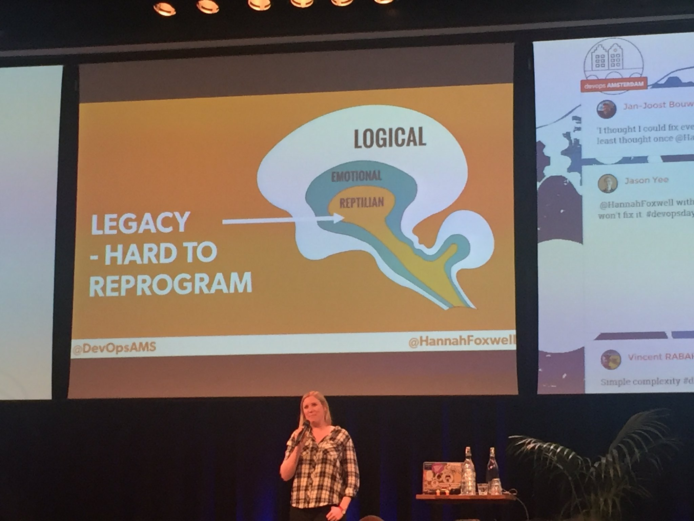

#Systems are Simple. Humans are Complex.

This was a super-quick talk, but very interesting, talking about the complex nature of belief / culture in humans, and how we should apply to dev ops. 

##Talk

We know culture is at the heart of devops

>"Containers will not fix your broken culture"
> "I thought I could fix everything with engineering"

Changing culture is hard, changing beliefs and values, may have been reinforced decades of working in silos. 

We have 90,000,000 brain cells, most of the processing we do is subconscious. 

Brain model:

Reptilian == legacy code (hard to reprogram). An analogy for this for the brain:
Finding a path that goes in a forest, it's easier to go down the well trodden path, but possible to forge new ones. Step back and take a think about what we're doing. 

>"Self-regulation is a finite resource in the brain"

>"Have patience. All things are difficult before they become easy".

>"The health of your infrastructure is not just about hardware, software, automations and uptime - it also includes the health and wellbeing of your team" - humanops.com
